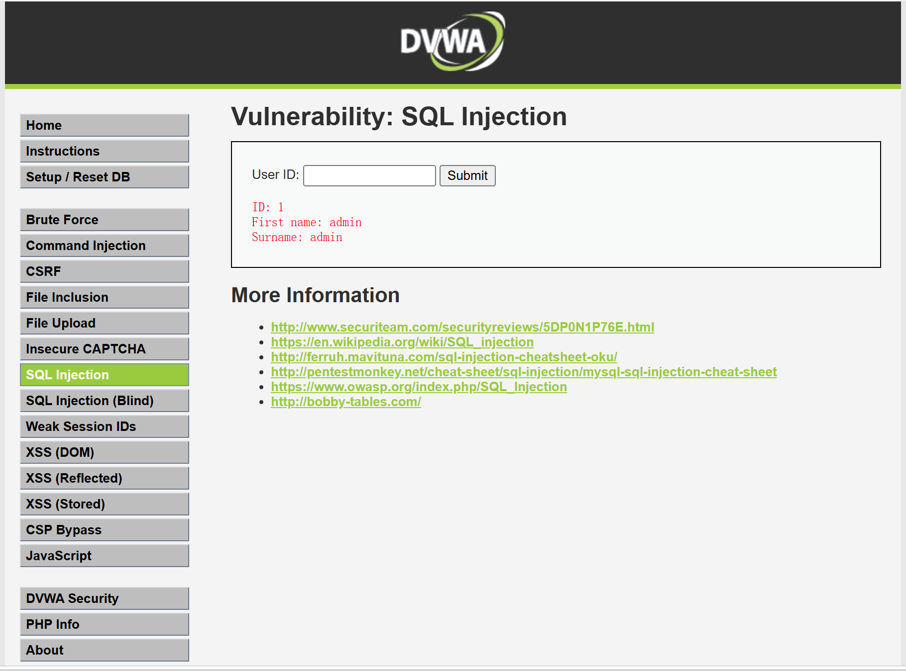
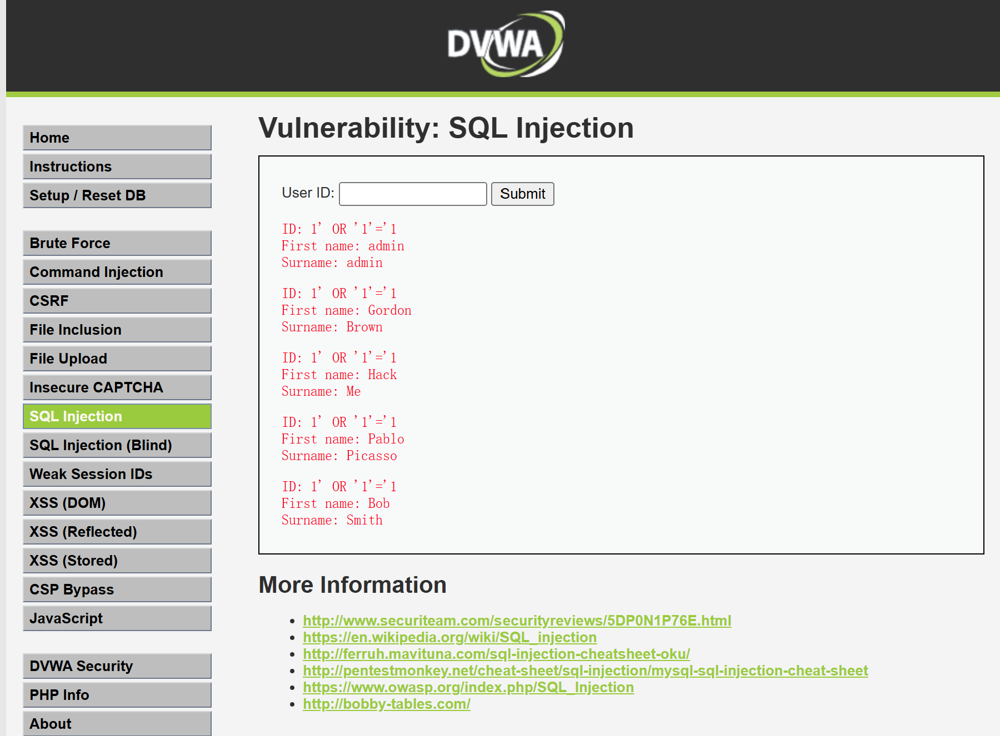
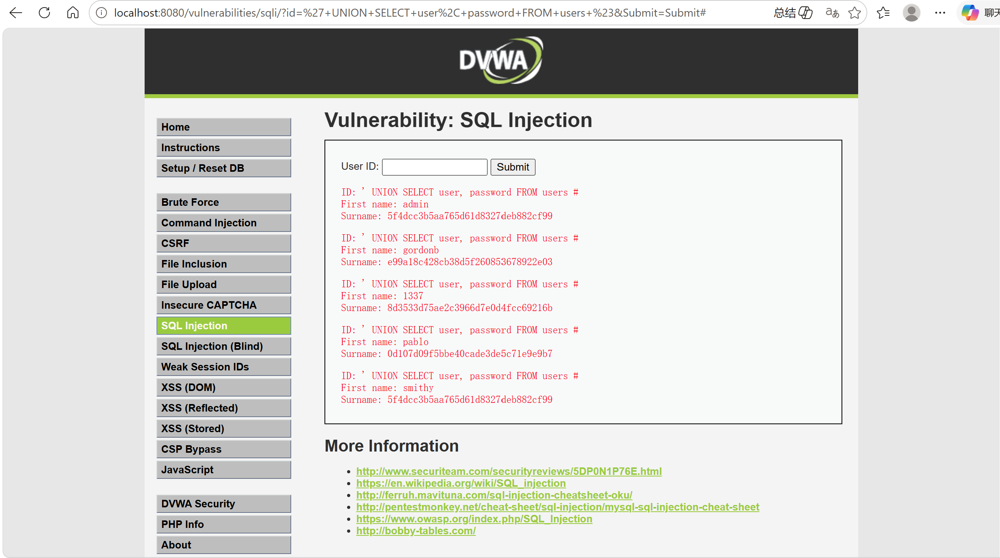

# SQL Injection Fundamentals

> Status: living note — last updated 2026-05-13
> Lab evidence: [`labs/dvwa-sql-injection-low/`](../labs/dvwa-sql-injection-low/)

This note covers what SQL injection is, why it remains one of the
highest-impact web vulnerabilities, how I reproduced it end-to-end against
a controlled local lab (DVWA, Security Level Low), and the defenses that
neutralize it in real applications.

The orientation is defensive: I want to be able to explain to a developer
*why* a payload works and *what change to the code* makes the class of
attack impossible — not just to memorize payloads.

---

## 1. What SQL Injection Is

SQL injection (SQLi) happens when an application interpolates
attacker-controlled data into a SQL query as code instead of as data. The
database parser cannot distinguish "the part the developer wrote" from
"the part the attacker provided," so payloads inside user input become
additional SQL clauses, additional statements, or replacement expressions.

The root cause is almost always **string concatenation of untrusted input
into a SQL string** somewhere along the request path. Every other
mitigation — WAFs, allow-listing, escaping — is a downstream patch on top
of this primitive defect.

### A minimal vulnerable example (PHP / MySQL)

```php
// VULNERABLE — do not deploy
$id = $_GET['id'];
$query = "SELECT first_name, last_name FROM users WHERE user_id = '$id'";
$result = mysqli_query($conn, $query);
```

If the request is `?id=1`, the query is:

```sql
SELECT first_name, last_name FROM users WHERE user_id = '1'
```

If the request is `?id=1' OR '1'='1`, the query becomes:

```sql
SELECT first_name, last_name FROM users WHERE user_id = '1' OR '1'='1'
```

The `WHERE` clause is now tautologically true, so the database returns
every row.

---

## 2. The Three Main Categories

SQLi techniques are usually grouped by *how the attacker gets data back*:

| Category | How the attacker reads results | Typical sign |
|---|---|---|
| **In-band (classic)** | Output is rendered directly on the page (error messages, UNION SELECT rows) | Database errors leak; UNION rows show up in the normal output |
| **Blind (inferential)** | No output is rendered; attacker infers data one bit at a time from app behavior or timing | Boolean-based: page differs on TRUE vs FALSE. Time-based: `SLEEP(5)` makes the response visibly slower |
| **Out-of-band** | Database is forced to make a network callback (DNS, HTTP) to attacker-controlled infrastructure | Used when in-band and blind both fail; depends on outbound network from the DB host |

The lab section below demonstrates in-band SQLi (both boolean-style and
UNION-based) against DVWA's Low difficulty.

---

## 3. Why It Matters for Defenders

A successful SQLi typically gives the attacker:

- **Full read access** to the database, including credential tables,
  session tables, and PII.
- In many configurations, **write access**: changing prices, granting
  admin roles, planting backdoor accounts.
- On older MySQL with `FILE` privileges, **filesystem read/write** via
  `LOAD_FILE` / `INTO OUTFILE`.
- On some database engines, **command execution** (e.g.
  `xp_cmdshell` on legacy SQL Server, UDF abuse on MySQL).
- A **persistent foothold**: stored credentials and session tokens
  exfiltrated from one SQLi can be replayed against other surfaces (mail,
  VPN, internal apps) even after the bug is patched.

For these reasons the OWASP Top 10 has kept injection in its top tier
since the project's inception, and most regulators treat unpatched SQLi
in customer-facing systems as a reportable security failure.

---

## 4. Lab Work — DVWA SQL Injection (Low)

> **Authorization note**: this lab is the Damn Vulnerable Web Application
> running inside Docker on my own laptop, on `localhost` only. No external
> systems were touched. DVWA is published explicitly for this kind of
> hands-on study.

### 4.1 Environment

- Host: Windows 11 + Docker Desktop (WSL 2 backend)
- Image: `vulnerables/web-dvwa` (Docker Hub)
- Launch: `docker run --rm -it -p 8080:80 vulnerables/web-dvwa`
- App URL: `http://localhost:8080`
- DVWA Security Level: **Low**
- Page exercised: **Vulnerability: SQL Injection** (`/vulnerabilities/sqli/`)

The Low-difficulty source of this page interpolates the `id` GET
parameter directly into the SQL string, so the page is the textbook
case of the minimal example in section 1.

### 4.2 Step 1 — Baseline behavior (well-formed input)

Submitting the normal input `1` returns the row for `user_id = 1`:



This confirms the page reads a single integer ID and renders one matching
row when the query is well-formed.

### 4.3 Step 2 — Boolean-style bypass (tautology)

Payload: `1' OR '1'='1`

Resulting query (conceptual):

```sql
SELECT first_name, last_name FROM users WHERE user_id = '1' OR '1'='1'
```

The injected `OR '1'='1'` short-circuits the `WHERE` clause, so the
database returns every row in `users`:



**Observation**: this is enough to prove the parameter is unsanitized and
that we are influencing the SQL parser, not just the application logic.

### 4.4 Step 3 — UNION-based data extraction

Payload: `' UNION SELECT user, password FROM users #`

Resulting query (conceptual):

```sql
SELECT first_name, last_name FROM users WHERE user_id = ''
UNION SELECT user, password FROM users #'
```

The empty `user_id = ''` matches no real row, so the only rows returned
come from the `UNION` half — which pulls the `user` and `password`
columns out of the `users` table, exposing usernames and password
hashes:



**Note on the comment character**: in MariaDB / modern MySQL the `--`
single-line comment requires a trailing whitespace, and HTML form fields
will trim trailing whitespace before submitting, which made `--` payloads
break for me. Using `#` (MySQL's other single-line comment marker) avoids
the issue entirely. This is a small but useful reminder that payload
syntax is shaped as much by the *transport* (HTML form, URL encoding,
JSON parsing) as by the database parser itself.

### 4.5 What this lab demonstrates

- The parameter is interpolated, not parameterized.
- An attacker who controls a single GET parameter can pivot from "read
  one row" to "read every row" to "read arbitrary columns from arbitrary
  tables" with two payloads totaling about 60 bytes.
- The page does not need to display column count or table names directly
  — `users` is a well-known DVWA table name, but in real targets the
  attacker would first enumerate via `information_schema`.

---

## 5. Defense Principles

The defenses below are listed in roughly the order that gives the best
risk reduction per unit of engineering effort.

### 5.1 Parameterized queries / prepared statements

The user-controlled value never participates in SQL parsing. The driver
sends the query template and the parameter as separate things over the
wire; the database executes the prepared plan with the parameter as
*data*, never as code.

```php
// SAFE
$stmt = $conn->prepare("SELECT first_name, last_name FROM users WHERE user_id = ?");
$stmt->bind_param("i", $id);
$stmt->execute();
```

This is the single highest-impact change. Most other defenses become
optional once the entire codebase uses parameterized queries
consistently.

### 5.2 ORMs and query builders (used correctly)

Modern ORMs (Hibernate, SQLAlchemy, Active Record, Prisma, Django ORM,
etc.) generate parameterized queries by default. The class of bug they
re-introduce is *raw query escape hatches* — `executeRawQuery`,
`db.execute(text(...))`, string-concatenated `WHERE` clauses inside
otherwise-ORM code. Code review should treat any raw SQL with
interpolation as a high-priority finding.

### 5.3 Principle of least privilege at the database layer

The database account used by the web tier should not own the schema,
should not have `FILE` privileges, should not have permission to drop
tables, and ideally should not have `INFORMATION_SCHEMA` read. Even if a
SQLi makes it to production, this caps the blast radius.

### 5.4 Defense in depth

- **WAF** signatures for SQLi: useful as a tripwire and rate limiter,
  not as the primary control. They are routinely bypassed by encoding
  tricks and case-mixing.
- **Input validation**: type-cast integer parameters to integers,
  length-cap strings, reject unexpected character classes for fields
  with known shape (e.g. UUIDs). Catches casual probes.
- **Output filtering** of database errors: never render raw `SQLSTATE`
  messages to the browser; they enable in-band exploitation by
  describing exactly which clause failed.

### 5.5 Detection

Even with all of the above, treat SQLi attempts as expected traffic and
make sure they are visible:

- Log full query strings (with parameter binding state) for any request
  that produces a database error.
- Alert on unusual query shapes: queries containing `UNION`, queries
  containing `INFORMATION_SCHEMA`, queries containing nested `SELECT`
  inside a parameter position.
- Track per-IP rates of database-error responses.

---

## 6. Next steps for this note

- Reproduce DVWA SQLi at Medium difficulty (which adds basic
  filter-and-`mysqli_real_escape_string` style defenses) to walk through
  how those mitigations are bypassed and why they are insufficient.
- Add a separate write-up on **Blind SQLi** (boolean + time-based)
  using DVWA's "SQL Injection (Blind)" page.
- Cross-reference one real-world CVE that traces back to interpolation
  in a popular open-source project, with the exact patch diff.

---

## 7. References

- OWASP — *SQL Injection Prevention Cheat Sheet*:
  https://cheatsheetseries.owasp.org/cheatsheets/SQL_Injection_Prevention_Cheat_Sheet.html
- OWASP — *SQL Injection*:
  https://owasp.org/www-community/attacks/SQL_Injection
- PortSwigger Web Security Academy — *SQL injection*:
  https://portswigger.net/web-security/sql-injection
- DVWA project: https://github.com/digininja/DVWA
- MySQL Reference — *Comments*:
  https://dev.mysql.com/doc/refman/8.0/en/comments.html
