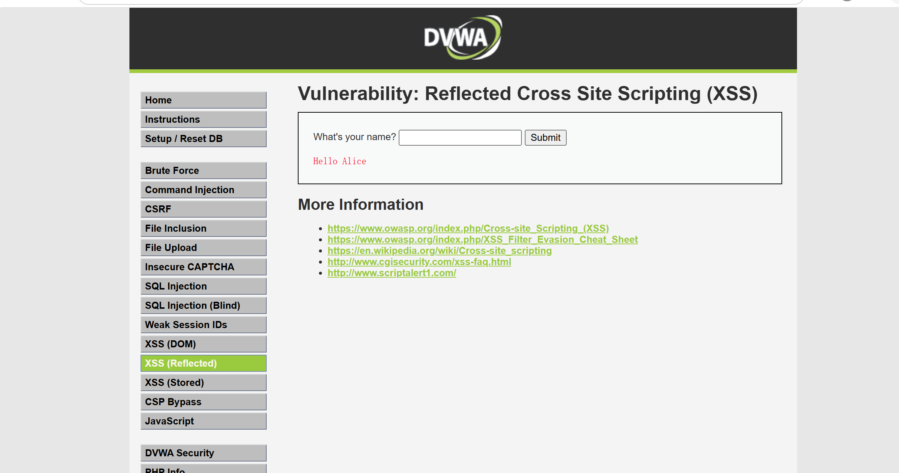
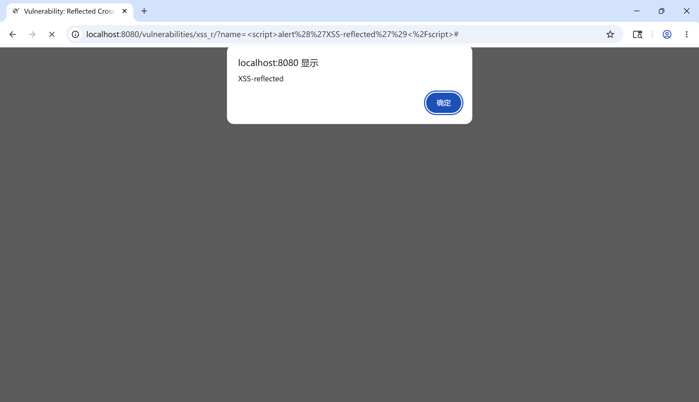
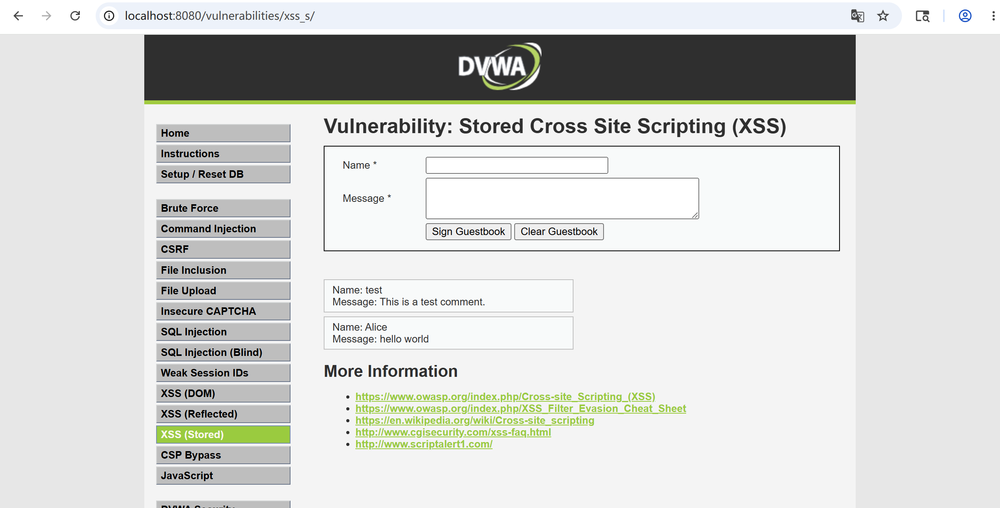
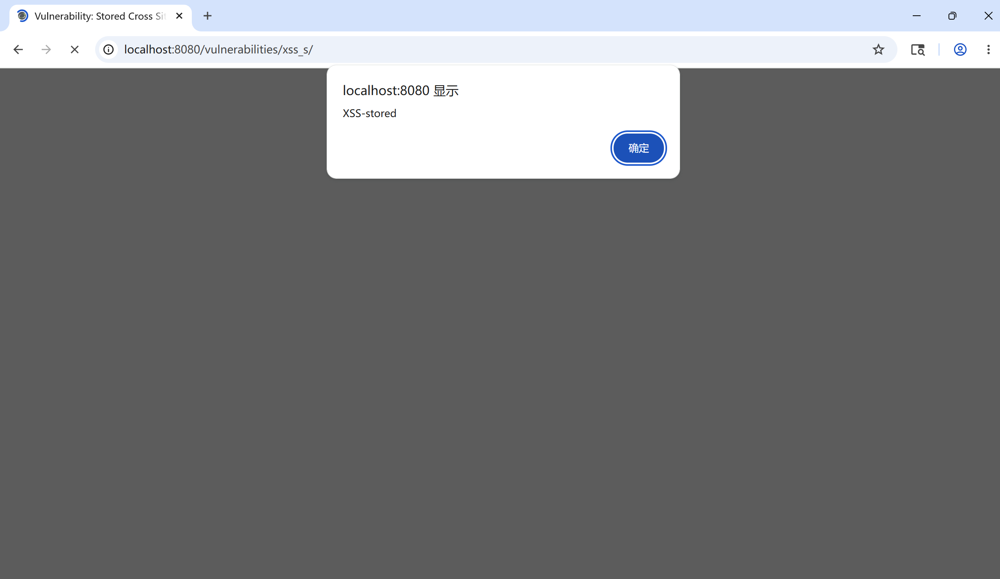

# Cross-Site Scripting (XSS) Fundamentals

> Status: living note — last updated 2026-05-13
> Lab evidence: [`labs/dvwa-xss-low/`](../labs/dvwa-xss-low/)

This note covers what cross-site scripting is, the three sub-classes
(reflected, stored, DOM-based), reproductions against DVWA Low for both
Reflected and Stored variants, and the defenses that work versus the
defenses that look like they should work but don't.

The orientation, as with the SQL injection note, is defensive: the goal
is to be able to explain to a developer the *one change* in the code
that makes a class of XSS impossible.

---

## 1. What XSS Is

XSS happens when an application renders attacker-controlled data into a
page *as part of the HTML / JavaScript document* rather than as inert
text. The browser cannot tell "the markup the developer wrote" from
"the markup the attacker provided," so attacker-supplied `<script>` (or
event handler, or `javascript:` URL) executes inside the application's
origin.

The damaging thing is not the script element itself; it is that the
script runs **with the victim's session in the application's origin**.
That means it can:

- Read the victim's cookies (where not `HttpOnly`).
- Read the victim's session-bound API responses.
- Issue authenticated requests on the victim's behalf.
- Read and modify any DOM in that origin.
- Persist (in the Stored variant) and reach every visitor.

XSS is functionally a session-takeover primitive even when no
single-step "give me admin" payload exists, because it composes
trivially with the rest of the application's authenticated surface.

---

## 2. The Three Sub-Classes

| Sub-class | Where the payload lives | Trigger |
|---|---|---|
| **Reflected** | In the request itself (URL, form body, headers) and reflected back in the response | Victim must click a crafted link / submit a crafted form |
| **Stored** | Persisted in the application's data store (DB row, file, profile field, comment) | Triggered automatically whenever any user views the page that renders the stored value |
| **DOM-based** | Never touches the server — the payload is in a `location.hash`, `document.referrer`, `postMessage`, etc., and a client-side script writes it into the DOM unsafely | Same as reflected (link click) but the vulnerable code is in JavaScript, not the server template |

Stored is the most impactful per-bug because the attacker does not need
to deliver a link — the application delivers the payload itself to every
viewer. DOM-based is the easiest to miss in code review because there is
no server-side template scanning the source for it.

---

## 3. Lab Work — DVWA Reflected XSS (Low)

> **Authorization note**: same as the SQLi note — DVWA running on
> `localhost:8080` inside my own Docker container, no external systems.

### 3.1 Page exercised

**Vulnerability: XSS (Reflected)** at `/vulnerabilities/xss_r/`.

At Low difficulty the page reads the `name` GET parameter and
concatenates it directly into the response HTML:

```php
// VULNERABLE (DVWA Low source)
echo "<pre>Hello " . $_GET['name'] . "</pre>";
```

### 3.2 Step 1 — Baseline

Submitting `Alice` in the form returns:

```html
<pre>Hello Alice</pre>
```

Plain text, no surprises.



### 3.3 Step 2 — Reflected payload

Payload: `<script>alert('XSS-reflected')</script>`

Resulting response body:

```html
<pre>Hello <script>alert('XSS-reflected')</script></pre>
```

The browser parses the `<script>` element as part of the document and
executes it. The alert fires immediately:



In a real attack the payload would not be an `alert()`; it would be a
fetch back to attacker-controlled infrastructure carrying
`document.cookie`, or a self-submitting form posting a CSRF action with
the victim's session.

---

## 4. Lab Work — DVWA Stored XSS (Low)

### 4.1 Page exercised

**Vulnerability: XSS (Stored)** at `/vulnerabilities/xss_s/`.

The form takes a *Name* and *Message* and inserts the message into a
guestbook table. At Low difficulty the message field is inserted with
only `mysqli_real_escape_string` (which is a SQLi defense, not an XSS
defense) and rendered raw on page load.

### 4.2 Step 1 — Baseline

Posting Name `Alice` / Message `hello world` appends a normal entry to
the guestbook.



### 4.3 Step 2 — Stored payload

Payload in the Message field: `<script>alert('XSS-stored')</script>`

The DVWA Low form has a `maxlength="50"` cap on Message, but this is
client-side only — easily bypassed by editing the attribute in DevTools
or submitting via `curl`. After submission, the row is rendered raw on
every subsequent visit to the page, so the script fires for any
visitor:



### 4.4 What the two labs together show

- **Reflected**: payload travels in the request, blast radius is one
  click per victim.
- **Stored**: payload sits in the database, blast radius is every
  visitor to the affected page until the row is removed.
- The vulnerable code shape is the same in both cases: untrusted input
  concatenated into an HTML document, no contextual encoding, no CSP.

---

## 5. Defenses That Work

### 5.1 Contextual output encoding

The single highest-impact control. Every place the application writes
user-controlled data into a response, it must encode that data for the
*specific* context it lands in:

- **HTML body** → HTML entity encoding (`&lt;`, `&gt;`, `&amp;`,
  `&quot;`, `&#x27;`).
- **HTML attribute** → attribute-safe encoding (and always quote the
  attribute).
- **JavaScript string literal** → JS string-escape encoding (`\x3c`,
  `<`, etc.).
- **URL parameter** → URL encoding.
- **CSS** → CSS escape encoding.

Modern frameworks do most of this automatically: React's JSX, Vue's
mustache, Angular's interpolation, Django templates, Jinja autoescape,
Razor — they all encode for HTML body context by default. The bugs
appear at the *escape hatches* (`dangerouslySetInnerHTML`, `v-html`,
`[innerHTML]`, `|safe`, `Html.Raw`) or when developers write data into
a non-HTML-body context (JS string, attribute, URL) without realizing
the default encoder is the wrong one.

### 5.2 Content Security Policy (CSP)

A strict CSP — ideally `script-src 'self'` plus nonces, with no
`'unsafe-inline'` and no `'unsafe-eval'` — turns most XSS bugs from
"session takeover" into "blocked at parse time, logged by the
`report-uri`." It is the single most useful *generic* mitigation when
output encoding has gaps.

### 5.3 HttpOnly + Secure + SameSite cookies

Does not stop XSS, but caps the most common payoff (cookie theft) and
reduces the success rate of follow-on CSRF-like primitives.

---

## 6. Defenses That Look Like They Work But Don't

- **Server-side blacklists** of `<script`, `onerror`, etc. There are
  dozens of bypasses (event handlers on every HTML element, SVG
  payloads, `<iframe srcdoc>`, mixed case, HTML entity smuggling, etc.).
- **Stripping** `<script>` tags after parsing. The XSS Filter Evasion
  Cheat Sheet exists precisely because this approach has been tried,
  failed, and re-tried for two decades.
- **`mysqli_real_escape_string`** as seen in DVWA Stored. It defends
  against SQLi by escaping SQL meta-characters; it does nothing about
  HTML meta-characters. Misapplied defenses are a common pattern.
- **WAF regex rules**. Useful as a tripwire and rate limiter, not as a
  primary control.

---

## 7. Next steps for this note

- Add a DOM-based XSS lab (DVWA XSS DOM page) showing how the bug
  lives entirely in client-side JavaScript and never touches the
  server.
- Walk through a CSP that would block the Reflected payload in section
  3 even though the underlying output-encoding bug is present, to
  illustrate defense in depth.
- Cross-reference a recent public XSS CVE with the patch diff.

---

## 8. References

- OWASP — *Cross Site Scripting Prevention Cheat Sheet*:
  https://cheatsheetseries.owasp.org/cheatsheets/Cross_Site_Scripting_Prevention_Cheat_Sheet.html
- OWASP — *DOM-based XSS Prevention Cheat Sheet*:
  https://cheatsheetseries.owasp.org/cheatsheets/DOM_based_XSS_Prevention_Cheat_Sheet.html
- PortSwigger Web Security Academy — *Cross-site scripting*:
  https://portswigger.net/web-security/cross-site-scripting
- MDN — *Content Security Policy*:
  https://developer.mozilla.org/en-US/docs/Web/HTTP/CSP
