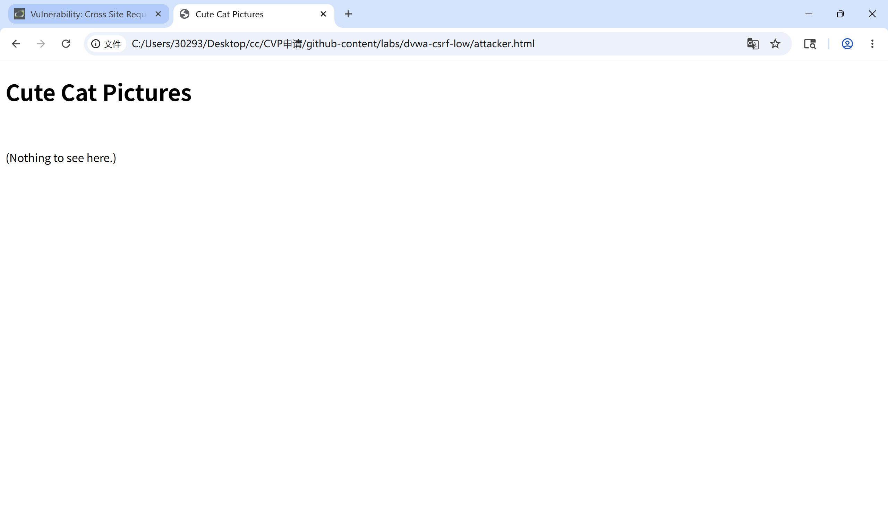
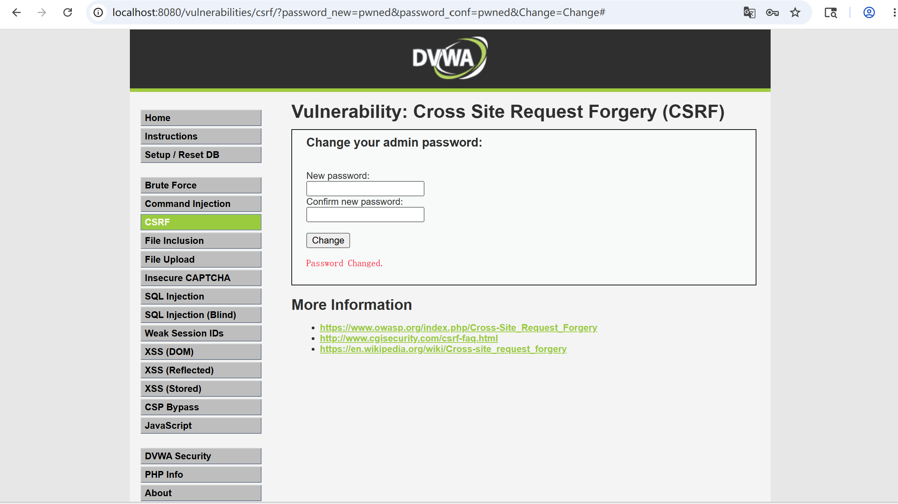

# Cross-Site Request Forgery (CSRF) Fundamentals

> Status: living note — last updated 2026-05-13
> Lab evidence: [`labs/dvwa-csrf-low/`](../labs/dvwa-csrf-low/)

This note covers what CSRF is, why it works, the DVWA Low reproduction
(an attacker-controlled HTML page that silently changes the victim's
password in a separate tab), and the defenses that have moved CSRF from
"top-three web bug" in 2010 to "rarely seen in greenfield apps" in 2026.

---

## 1. What CSRF Is

CSRF abuses the browser's habit of attaching the victim's session cookie
to *every* request to the application's origin, including requests
initiated by code running on a completely different site.

If `bank.example` is vulnerable and the victim is logged in, an
attacker-controlled page `evil.example` can include something as simple
as:

```html

```

The browser sees an image load to `bank.example`, attaches the
`bank.example` session cookie, and the bank's server cannot tell the
difference between "the victim clicked Transfer in our UI" and "the
victim viewed a malicious page that triggered the request."

The two preconditions for a classic CSRF are therefore:

1. The application performs a state-changing action via a request shape
   the attacker can reproduce from a foreign origin (GET, or simple
   form POST, or `fetch` with `mode: 'no-cors'`).
2. The application relies on ambient credentials (cookies) and does
   nothing else to bind the request to the user's *deliberate* intent.

---

## 2. Lab Work — DVWA CSRF (Low)

> **Authorization note**: DVWA running on `localhost:8080` inside my
> own Docker container. The "attacker page" is a local HTML file I open
> in a second tab.

### 2.1 Page exercised

**Vulnerability: CSRF** at `/vulnerabilities/csrf/`.

The DVWA "Change Password" form sends both the new password and the
confirmation as **GET parameters**:

```
GET /vulnerabilities/csrf/?password_new=newpass&password_conf=newpass&Change=Change
```

There is no anti-CSRF token, no re-authentication, no `SameSite`
cookie, no `Origin` check.

### 2.2 The exploit page

I created a small HTML file `attacker.html` and opened it in a second
tab while logged into DVWA in the first tab:

```html
<!doctype html>
<html>
  <body>
    <h1>Cute Cat Pictures</h1>
    
    <p>(Nothing to see here.)</p>
  </body>
</html>
```

That's it — a single `` tag pointing at the password-change
endpoint with the attacker's chosen new password as a GET parameter.

### 2.3 What happens

1. The browser loads `attacker.html`.
2. The `` triggers a GET to `localhost:8080/vulnerabilities/csrf/...`.
3. The browser attaches the DVWA session cookie automatically.
4. DVWA's server sees a request from an authenticated user with
   `password_new` and `password_conf` parameters and changes the
   password.
5. Returning to the DVWA tab and logging out / back in: the original
   password no longer works; `pwned` does.

### 2.4 Screenshots to capture

See [`STEPS.md`](../labs/dvwa-csrf-low/STEPS.md) in the lab folder for
the exact reproduction.





### 2.5 Why this is worth understanding even though "everyone uses
SameSite now"

The DVWA case is the simplest possible CSRF — a state-changing GET.
Real apps that have moved to POST-only state changes plus SameSite
cookies are mostly immune to this exact shape. But the *class* of bug
recurs in several still-common forms:

- POST endpoints that accept `Content-Type: text/plain` or
  `application/x-www-form-urlencoded` and can be triggered by a
  cross-origin auto-submitting form.
- API endpoints that accept JSON and rely on `Content-Type:
  application/json` as the only check, while CORS preflight is somehow
  bypassed (legacy proxies, misconfigured `Access-Control-Allow-*`,
  `simple-request` smuggling).
- Mobile webview contexts where SameSite enforcement is inconsistent
  between OS versions.
- Internal apps on private origins where the team assumed "internal
  only, no need for CSRF tokens" — until a Stored-XSS-elsewhere makes
  the call.

So CSRF defenses are still worth implementing as defense in depth, not
abandoned because SameSite "solves it."

---

## 3. Defenses That Work

### 3.1 SameSite cookies

Setting session cookies as `SameSite=Lax` (default in modern Chrome
since 2020) prevents the browser from attaching them to cross-site
*top-level* navigations triggered by an attacker page for unsafe HTTP
methods. `SameSite=Strict` is stricter but breaks legitimate inbound
links. `SameSite=None; Secure` is required for genuine cross-site
cookie use cases (federation, embedded widgets) and re-enables CSRF
risk, so anything using `None` needs the token-based defenses below.

### 3.2 Synchronizer token pattern (anti-CSRF tokens)

Server generates a per-session (or per-request) random token, embeds
it in the form / sends it in a custom header. Every state-changing
request must include the token; the server rejects requests without
it. Because the attacker page cannot read the victim's DOM (same-origin
policy), it cannot retrieve the token, and the forged request fails.

Built into every modern web framework — Django (`csrf_token`),
Rails (`authenticity_token`), Spring Security
(`CsrfTokenRepository`), ASP.NET (`AntiForgeryToken`), Express
(`csurf` historically, now usually framework-specific).

### 3.3 Origin / Referer header checks

For requests where setting a custom header is feasible, checking
`Origin` (and falling back to `Referer`) against an allow-list of
trusted origins catches the basic cases cheaply. Not sufficient alone
because `Origin` can be `null` in some legitimate cases and `Referer`
can be stripped by `Referrer-Policy`, but useful as a layered defense.

### 3.4 Re-authentication for high-impact actions

For password change, email change, MFA disable, financial transfers:
require the current password (or a fresh second-factor) as part of the
request itself. DVWA's CSRF page would be unexploitable in this exact
shape if it required the *current* password in the change form,
because the attacker doesn't know it.

---

## 4. Common mistakes

- **Using GET for state-changing actions** (DVWA exactly). Even with
  SameSite=Lax, GET requests embedded in top-level navigations still
  carry cookies under specific conditions; the better fix is to make
  state changes POST-only and add CSRF tokens.
- **Tying the token to the wrong scope**: a single global token, a
  token tied to the user but not the session, a token never rotated —
  all of these reduce the protection.
- **Relying on `Content-Type: application/json` alone**: an
  attacker-controlled form can send
  `Content-Type: text/plain` to a JSON endpoint that doesn't strictly
  validate. Combine with explicit method + Origin checks.

---

## 5. Next steps for this note

- Reproduce the same CSRF on DVWA Medium difficulty (which adds a
  `Referer` check) to show how that mitigation is bypassed by hosting
  the exploit page on a path that includes the target hostname.
- Add a write-up on `SameSite` cookie nuances: `Lax-by-default`
  behavior in Chrome, the 2-minute "Lax+POST" window, and what
  `SameSite=None; Secure` re-enables.

---

## 6. References

- OWASP — *Cross-Site Request Forgery Prevention Cheat Sheet*:
  https://cheatsheetseries.owasp.org/cheatsheets/Cross-Site_Request_Forgery_Prevention_Cheat_Sheet.html
- PortSwigger Web Security Academy — *CSRF*:
  https://portswigger.net/web-security/csrf
- MDN — *SameSite cookies*:
  https://developer.mozilla.org/en-US/docs/Web/HTTP/Headers/Set-Cookie/SameSite
