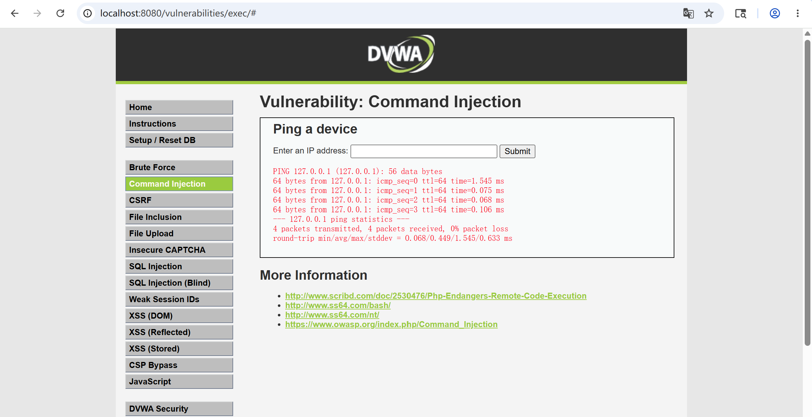

# OS Command Injection Fundamentals

> Status: living note — last updated 2026-05-13
> Lab evidence: [`labs/dvwa-command-injection-low/`](../labs/dvwa-command-injection-low/)

This note covers OS command injection: what it is, why it is structurally
similar to SQL injection (both are *parser confusion* bugs at the
trust boundary between application and a downstream interpreter), a DVWA
Low reproduction, and the defenses that work at the language / API layer
versus the patches that look reasonable but do not.

---

## 1. What Command Injection Is

Command injection happens when an application takes attacker-controlled
input and incorporates it into a string that is then handed to a shell
to be executed. The shell parses the entire string — including any
metacharacters from the attacker — and the attacker's payload becomes
additional commands, additional arguments, or replacement commands.

```php
// VULNERABLE — do not deploy
$target = $_GET['ip'];
$output = shell_exec("ping -c 4 " . $target);
echo "<pre>$output</pre>";
```

If `ip = 8.8.8.8`, the shell runs `ping -c 4 8.8.8.8`. If `ip =
8.8.8.8; cat /etc/passwd`, the shell runs *two* commands: the ping
and then `cat /etc/passwd`. The attacker has gone from "the app pings
hosts for me" to "the app runs arbitrary OS commands as the web user."

The root cause, as with SQLi, is **passing untrusted data through a
parser as code instead of as data**. The fix is structurally identical
too: stop concatenating into a string the parser sees; pass data as
data through an API that distinguishes the two.

---

## 2. The Three Shells of Metacharacters to Watch For

| Class | Examples | What they do |
|---|---|---|
| **Command separators** | `;`, `\n`, `&`, `&&`, `\|`, `\|\|` | End the current command and run another |
| **Substitution** | `` `cmd` ``, `$(cmd)` | Run `cmd` and substitute its stdout in place |
| **Redirection** | `>`, `<`, `>>`, `2>&1` | Write/read files; can be used to drop a webshell or exfiltrate output |

Any one of these in attacker-controlled territory is enough to turn the
target endpoint into a generic remote command execution primitive. The
typical bug-bounty progression once a single character works is: confirm
shell metacharacters are honored → confirm output is reflected (or use
out-of-band DNS / HTTP) → enumerate the user, the host, the network
position, the available binaries → pick the smallest, quietest payload
that proves impact in the report.

---

## 3. Lab Work — DVWA Command Injection (Low)

> **Authorization note**: DVWA running on `localhost:8080` inside my
> own Docker container, no external systems.

### 3.1 Page exercised

**Vulnerability: Command Injection** at `/vulnerabilities/exec/`.

The page asks for an IP address and runs `ping` against it. At Low
difficulty the source concatenates the input directly into the shell
command (with a trivial OS-detection branch):

```php
// VULNERABLE (DVWA Low source, simplified)
$target = $_REQUEST['ip'];
if (stristr(php_uname('s'), 'Windows NT')) {
    $cmd = shell_exec('ping ' . $target);
} else {
    $cmd = shell_exec('ping -c 4 ' . $target);
}
echo "<pre>$cmd</pre>";
```

### 3.2 Step 1 — Baseline

Input `127.0.0.1` → the page runs `ping -c 4 127.0.0.1` and renders the
ping output.



### 3.3 Step 2 — Chain a second command with `;`

Payload: `127.0.0.1; id`

The shell now parses **two** statements:

```
ping -c 4 127.0.0.1
id
```

The page renders both outputs concatenated:

```
PING 127.0.0.1 (127.0.0.1) 56(84) bytes of data.
64 bytes from 127.0.0.1: icmp_seq=1 ttl=64 time=0.040 ms
...
uid=33(www-data) gid=33(www-data) groups=33(www-data)
```


This confirms two things at once:

1. We control the shell, not just the application.
2. The web server runs as `www-data` — i.e., the impact ceiling for
   this single bug is "everything `www-data` can do on this container."

### 3.4 Step 3 — Read a sensitive file

Payload: `127.0.0.1 && cat /etc/passwd`

`&&` runs the second command only if the first succeeded; for our
purposes it works the same as `;`. The page renders the contents of
`/etc/passwd`:


In a real engagement the report would stop here, with a clearly-impact
file (e.g., a config file containing DB credentials, a private key, or
an `.env`) and a clean payload — no destructive commands.

### 3.5 What this lab demonstrates

- A single GET parameter that lands in `shell_exec` is a full RCE.
- The web user typically does not need to be root for the bug to be
  game-over: anything that `www-data` can read (config, app source,
  session storage, AWS metadata service from inside a container) is in
  scope.
- The DVWA Low source uses no input validation, no allow-list, no
  escaping. Going to Medium difficulty adds a blacklist for `&&` and
  `;` only — which is bypassed in one step with `|` or `%0a`, which is
  exactly the lesson the level is meant to teach.

---

## 4. Defenses

### 4.1 Don't go through a shell at all

The structural fix is to call the underlying program *without invoking
a shell to parse the command line for you*. Almost every language
gives you both options:

- Python: `subprocess.run(["ping", "-c", "4", target], shell=False)`
- Node: `child_process.execFile("ping", ["-c", "4", target])`
  (not `exec`).
- Go: `exec.Command("ping", "-c", "4", target)` (the arguments are an
  `[]string`, the shell is never involved).
- Java: `ProcessBuilder` with a list of arguments.
- PHP: rely on `escapeshellarg` *and* pass via the array form of
  `proc_open`, or — better — use a higher-level library that doesn't
  shell out at all.

When the OS gets argv as discrete strings, none of the shell
metacharacters above mean anything to the parser. `; cat /etc/passwd`
becomes a single literal hostname that `ping` will helpfully fail to
resolve.

### 4.2 Strict input validation by type

For inputs with a known shape — IP address, hostname, integer ID,
UUID, file path inside a known directory — validate that the input
matches a strict pattern before it goes anywhere near `exec`. Reject
on any character outside the allowed class. The DVWA `ip` field
should accept `^[0-9.]{7,15}$` and reject everything else; that alone
removes the bug.

### 4.3 Don't try to escape your way out

`escapeshellarg`, `escapeshellcmd`, `shlex.quote`, manual `\` escaping
— all of these are reasonable as a *secondary* layer, but they are
the same class of defense as "blacklist `<script>` for XSS." There
are well-known bypasses for each, especially in nested shell
contexts (`sh -c 'sh -c "..."'`). Treat them as suspect signal: every
time you see escape-based defense in a code review, the question is
"why isn't this using `shell=False`?"

### 4.4 Reduce blast radius

- Run the web tier as a non-privileged user (DVWA's container already
  does this — `www-data`).
- Drop Linux capabilities in the container (`--cap-drop ALL`).
- Use a read-only root filesystem where possible
  (`--read-only` + tmpfs for `/tmp`).
- For requests that should never need outbound network, block egress
  at the network policy layer. This stops the most common
  post-exploitation moves (downloading a reverse shell, exfiltrating
  data over DNS, calling out to a C2).

### 4.5 Detection

- Alert on `shell_exec` / `system` / `popen` calls in code review
  scans.
- At runtime, log full command strings sent to the shell. Any command
  containing `;`, `|`, backticks, `$(`, `>`, `<` that wasn't generated
  by code you control is high-signal.
- Monitor for the web user spawning unexpected children
  (`/etc/passwd` read, `id`, `whoami`, `uname -a`, anything in
  `/tmp/*.sh`) — these are textbook post-RCE enumeration patterns.

---

## 5. Next steps for this note

- Reproduce DVWA Medium (which blacklists `&&` and `;`) and Hi (which
  uses a partial allow-list) to show how trivially blacklist defenses
  fall to alternative metacharacters and how a strict input validator
  succeeds where escaping fails.
- Cross-reference one recent public command-injection CVE in a widely
  deployed service (e.g., a network appliance or a CI runner) with
  the patch diff.

---

## 6. References

- OWASP — *Command Injection*:
  https://owasp.org/www-community/attacks/Command_Injection
- OWASP — *OS Command Injection Defense Cheat Sheet*:
  https://cheatsheetseries.owasp.org/cheatsheets/OS_Command_Injection_Defense_Cheat_Sheet.html
- PortSwigger Web Security Academy — *OS command injection*:
  https://portswigger.net/web-security/os-command-injection
- Python docs — *Security considerations* for the subprocess module:
  https://docs.python.org/3/library/subprocess.html#security-considerations
